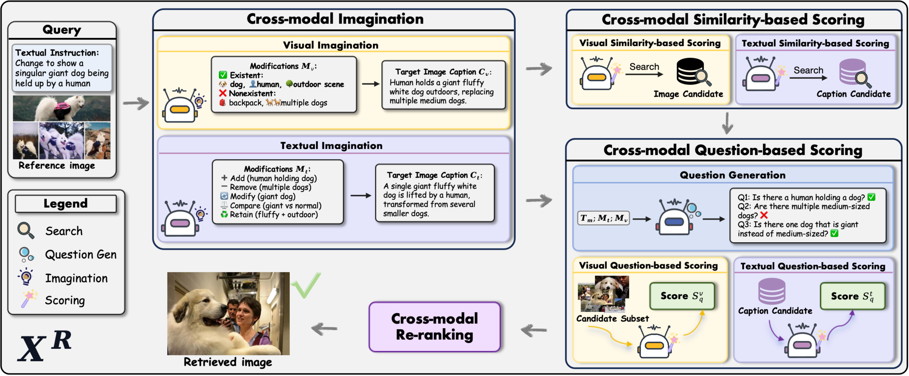
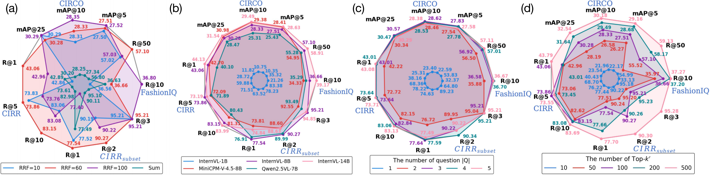
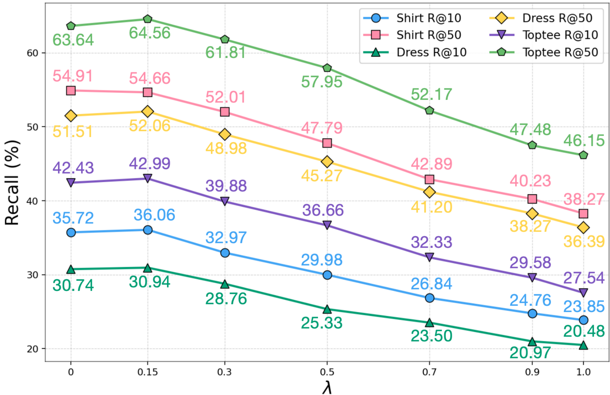

<div align="center">
  <h1>🚀 XR: Cross-Modal Agents for Composed Image Retrieval</h1>
  <h3>Training-free multi-agent pipeline for edit-sensitive retrieval</h3>
  <p>WWW 2026 · <a href="https://doi.org/10.1145/3774904.3792276">DOI</a> · <a href="https://arxiv.org/abs/2503.10166">arXiv:2503.10166</a></p>
</div>

<div align="center">
  
</div>

<div align="center">
  <p>Authors: Zhongyu Yang, Wei Pang, Yingfang Yuan<sup>★</sup> (BCML, Heriot-Watt University)</p>
  <p><sup>★</sup>Corresponding author · zy4028@hw.ac.uk · w.pang@hw.ac.uk · y.yuan@hw.ac.uk</p>
</div>

---

## ✨ Highlights
- 🧠 Training-free multi-agent stack: imagination → similarity agents (coarse) → question agents (fine) for edit-sensitive CIR.
- 🎯 Cross-modal anchors: generate dual captions and hybrid scores to close text–vision gaps before retrieval.
- ⚡ Ray-based multi-GPU inference; prompts/states auto-copied into each `runs/` folder for exact replay.
- 📦 One-time `image_db/` cache (captions + CLIP embeddings) per dataset + CLIP version; seeded (`xr_SEED=42`) for stability.
- 📈 Up to ~38% gain over strong training-based/free baselines on FashionIQ, CIRR, CIRCO (per paper).

<div align="center">
  
</div>

XR reframes composed image retrieval as progressive reasoning: 🧪 imagination agents create target proxies from cross-modal pairs, 🔍 similarity agents fuse visual/text cues with RRF for coarse filtering, and ✅ question agents verify candidates via predicate-style checks before final re-ranking.

## 🛠️ Quickstart
```bash
conda create -n xr python=3.10.14
conda activate xr

# PyTorch + vision (CUDA 11.8 wheels)
pip install torch==2.4.0 torchvision==0.19.0 --index-url https://download.pytorch.org/whl/cu118

# Performance extras (match CUDA)
pip install xformers==0.0.27.post2 --index-url https://download.pytorch.org/whl/cu118
pip install https://github.com/vllm-project/vllm/releases/download/v0.5.4/vllm-0.5.4+cu118-cp310-cp310-manylinux1_x86_64.whl

# Project deps (pinned)
pip install -r requirements.txt
```
Tips:
- 🔒 Keep wheel versions aligned; mixing CUDA builds (e.g., torch 2.4 + vLLM 0.8.x) can cause ABI errors.
- 💾 HF cache defaults to `~/.cache/huggingface`; set `HF_HOME` if you need more space.

## 🧠 Model Paths
Pass these to `xr.py` (or edit `scripts/run_*.sh`). If blank, `_resolve_model_path` falls back to env defaults then `OpenGVLab/InternVL3-8B`.
- `--llm_path`: stage-1 reasoner (text).
- `--mllm_path`: verifier MLLM.
- `--img_cap_model_path`: captioner MLLM (builds `image_db/`).
- `--eval_mllm_path`: evaluator MLLM for stage-3.
- `--clip_path`: CLIP/vision encoder, e.g., `laion/CLIP-ViT-L-14-laion2B-s32B-b82K`.

## 📂 Data Layout
Root folder (default `data/`) should contain:
```
data
├── CIRCO
├── CIRR
├── FashionIQ
├── Flickr30K
├── MSCOCO
└── VisDial
```
- CIRCO: captions/{val.json,test.json}, unlabeled2017/*.jpg  
- CIRR: captions/, captions_ext/, image_splits/, dev/, test1/ (add `--subset` for subset runs)  
- FashionIQ: images/, image_splits/split.{dress,shirt,toptee}.val.json, captions/cap.{dress,shirt,toptee}.val.json  

## ▶️ Run Inference
Example (FashionIQ-dress, valid split):
```bash
CUDA_VISIBLE_DEVICES=0,1 python xr.py \
  --dataset FashionIQ-dress --split valid --run_name fiq-dress \
  --s2_num_questions 1 \
  --llm_path OpenGVLab/InternVL3-8B \
  --mllm_path OpenGVLab/InternVL3-8B \
  --img_cap_model_path OpenGVLab/InternVL3-8B \
  --eval_mllm_path OpenGVLab/InternVL3-8B \
  --clip_path laion/CLIP-ViT-L-14-laion2B-s32B-b82K \
  --dataset_path /path/to/data
```
Notes:
- 🎛️ Uses all visible GPUs via Ray; limit with `CUDA_VISIBLE_DEVICES=...`.
- 🗂️ First run per dataset/CLIP builds `image_db/{dataset}/{clip_version}/` (captions + embeddings) then reuses it.
- 🧪 CIRR subset: add `--subset`.
- 🧩 More knobs: `--stage1_retrieve_texts`, `--stage2_source`, `--stages`, `--restore_states`, `--stage_skip_num` (see `xr.py`).

## 📊 Outputs & Evaluation
- Logs/prompts/states: `runs/{dataset}_{split}/{clip_version}-{run_name}_{timestamp}/`.
- Intermediate states: `states.pkl` (plus per-round) capture retrieval scores for replay.
- Metrics or submissions:
  - FashionIQ/Flickr30K/MSCOCO/VisDial → `output.log`.
  - CIRCO/CIRR → submit `{timestamp}_{dataset}_test_stage3_eval.json` to official servers.


## 🧪 Ablations & Cases
<div align="center">
  
  
</div>

<div align="center">
  
  
  
</div>

## ♻️ Repro Tips
- Keep `xr_SEED` (default 42) consistent for deterministic sampling.
- Reuse the same `--clip_path` to avoid rebuilding `image_db/`; delete `image_db/{dataset}/{clip_version}` to force regeneration.
- Prompts used for a run are copied into `runs/...`; archive that folder with the submission JSON for full traceability.

## 📚 Citation
If you find our paper and code useful, please cite:
```bibtex
% coming soon
```
